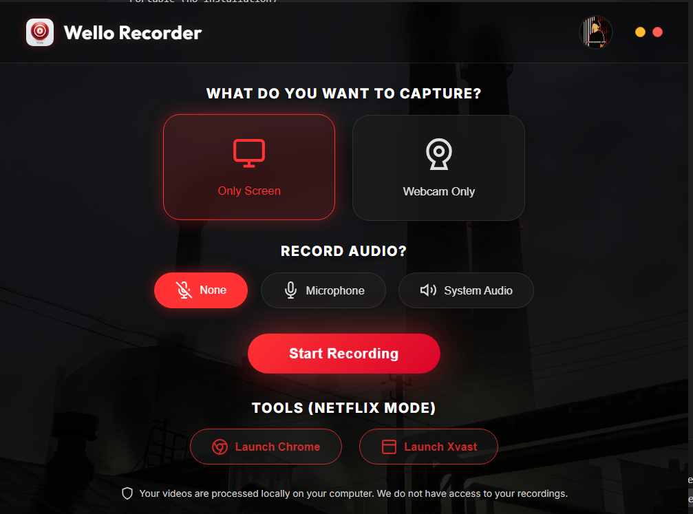

# Wello Recorder

**Screen recorder with DRM bypass for educational purposes**

  

## Features

🎥 **HD Recording** (1080p/60fps) • 🔓 **DRM Bypass** (Chrome/Edge) • ⏱️ **Free Trial** (20 mins)  
💎 **Crypto Payments** • 🎯 **Draggable Overlay** • ⏯️ **Pause/Resume** • 💾 **Ultra Portable** (~240MB Extracted)

## 💎 Pricing Plans

| Plan | Hours | Price | Rate |
| :--- | :---: | :---: | :--- |
| **Starter** | 5 Hours | **$5** | $1.00/hr |
| **Pro** ⭐ | **20 Hours** | **$15** | $0.75/hr |
| **Elite** | 100 Hours | **$50** | $0.50/hr |

💳 **Accepted Payments:** USDT (TRC20), Bitcoin (BTC), Binance Pay

## ⏱️ Free Trial

New users automatically get a **20-minute free trial** (0.34 hours) to test the application.
- Activates automatically on first launch.
- No credit card required.
- One-time use per device.

## 🚀 Getting Started

1. **[Download Latest Release](https://github.com/hackerzfx/WelloRecorder/releases/latest)** (~70 MB)
2. Extract the ZIP file
3. Run `Wello.exe`
4. **Free Trial:** Starts automatically (20 mins)

### 🔓 Recording with XVast
Launch **XVast** directly from Wello Recorder.
> **Note:** When it opens in an isolated profile, you can simply Minimize it and **switch to your original profile** within the browser to access all your saved logins, passwords, and data.

**Note:** Windows may show a warning on first run. Click "More Info" → "Run Anyway".

## Screenshots


*(New Compact Payment UI)*

## Known Issues

- **Antivirus**: May flag as false positive (Open Source, check code)

## Development

```bash
git clone https://github.com/hackerzfx/WelloRecorder.git
cd WelloRecorder
npm install
npm start
```

## License & Author

MIT License • **Hamza Modder** • 

---

⚠️ **Educational Use Only** - Recording copyrighted content may violate platform ToS.
